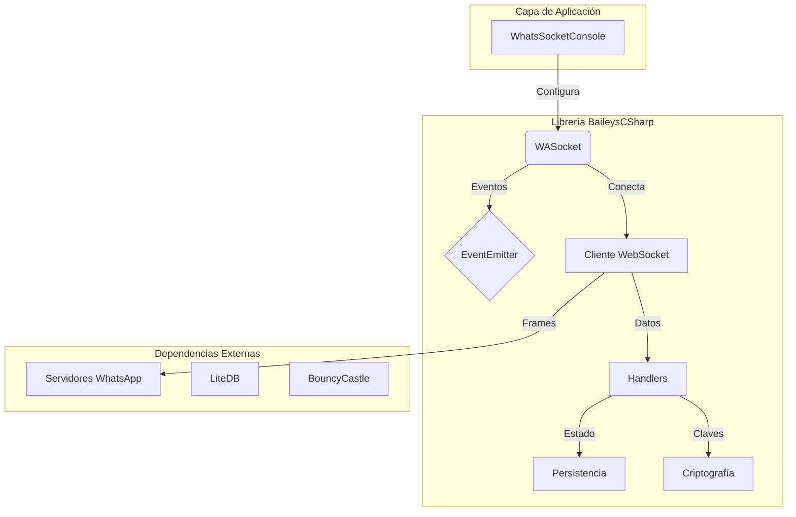

# Arquitectura unificada

## Tabla de contenidos
- [Diagrama general](#diagrama-general)
- [Componentes y dependencias](#componentes-y-dependencias)
- [Divergencias](#divergencias)
- [Proveniencia](#proveniencia)

## Diagrama general

## Componentes y dependencias
- `WASocket` como fachada de operaciones.
- `EventEmitter` difunde cambios de estado.
- Persistencia mediante LiteDB y archivos.
- Criptografía basada en BouncyCastle/LibSignal.

## Divergencias
- Codex destaca una cadena de sockets especializada.
- Copilot describe patrones adicionales como Observer y Factory.

## Proveniencia
- [Codex](../DocumentationCodex/02-arquitectura-actual.md)
- [Jules](../DocumentationJules/02-arquitectura-actual.md)
- [Copilot](../DocumentationCopilot/02-arquitectura-actual.md)
