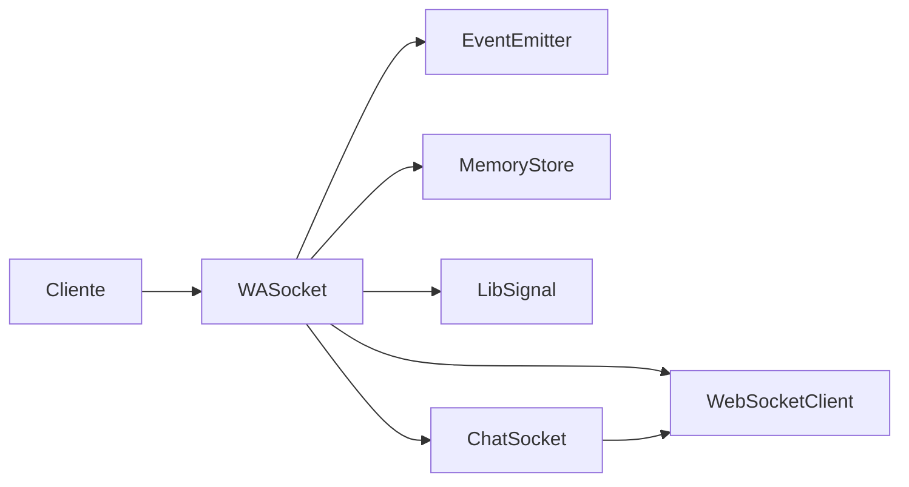

# 20. Arquitectura unificada

- [Diagrama canónico](#diagrama-canónico)
- [Notas](#notas)

## Diagrama canónico

## Notas
Codex resaltó el acoplamiento entre `BaseSocket` y la persistencia.
Jules describió capas desde la aplicación hasta la criptografía.
Copilot añadió sockets especializados para grupos y mensajes.
La decisión final es mantener `WASocket` como fachada pero delegar transporte, negocio y almacenamiento mediante interfaces.

### Proveniencia
- [DocumentationCodex/02-arquitectura-actual.md](../DocumentationCodex/02-arquitectura-actual.md)
- [DocumentationJules/02-arquitectura-actual.md](../DocumentationJules/02-arquitectura-actual.md)
- [DocumentationCopilot/02-arquitectura-actual.md](../DocumentationCopilot/02-arquitectura-actual.md)

