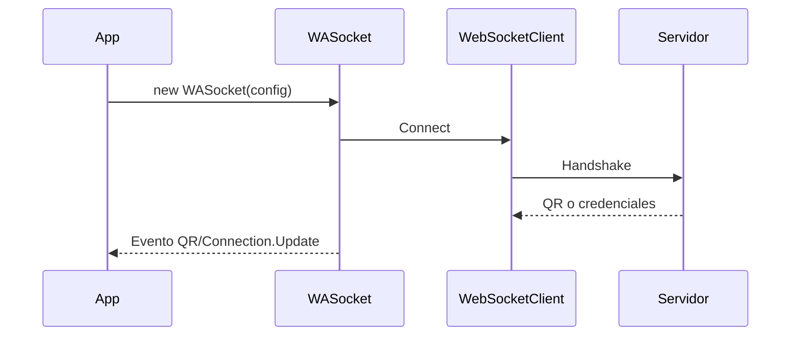
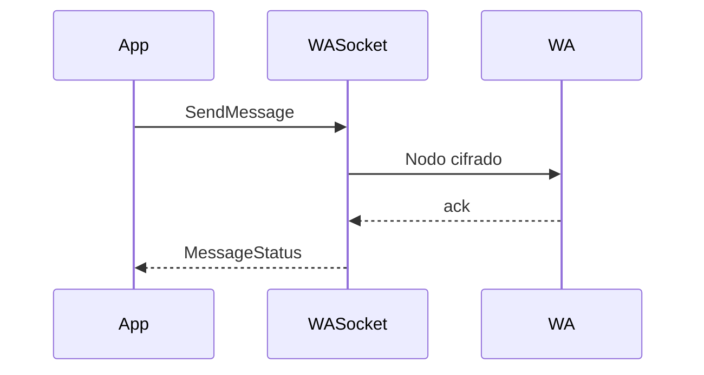
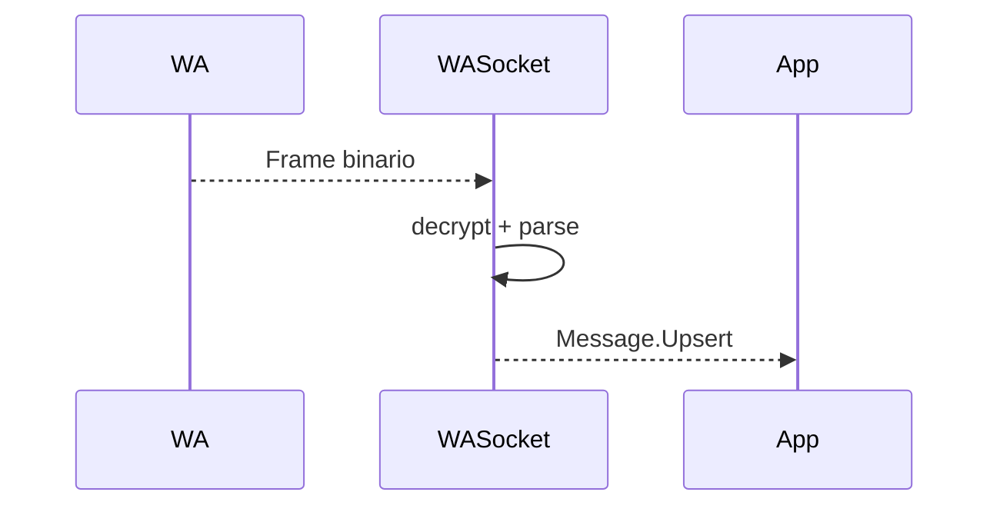
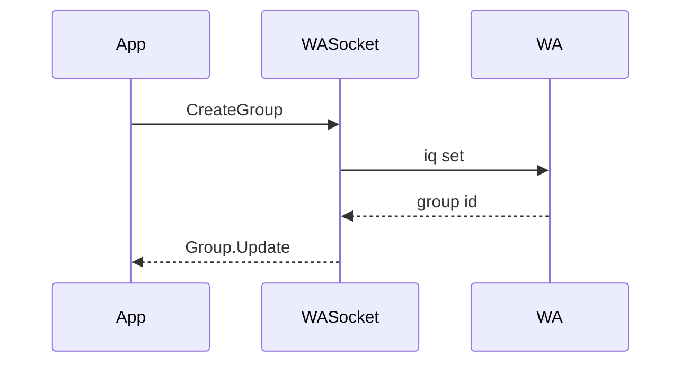
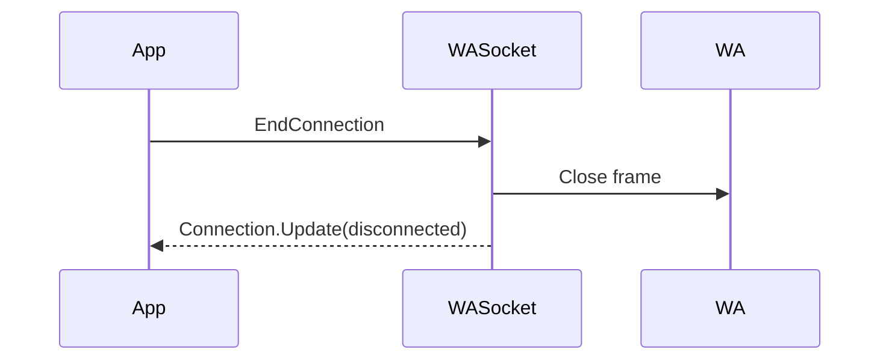

# 22. Flujos unificados

- [Conectar y autenticar](#conectar-y-autenticar)
- [Enviar mensaje](#enviar-mensaje)
- [Recibir mensaje](#recibir-mensaje)
- [Gestionar grupos](#gestionar-grupos)
- [Cerrar conexión](#cerrar-conexión)

## Conectar y autenticar

Errores: expiración de QR, timeouts.

## Enviar mensaje

## Recibir mensaje

## Gestionar grupos

## Cerrar conexión

### Proveniencia
- [DocumentationCodex/04-flujos-tecnicos.md](../DocumentationCodex/04-flujos-tecnicos.md)
- [DocumentationJules/04-flujos-tecnicos.md](../DocumentationJules/04-flujos-tecnicos.md)

