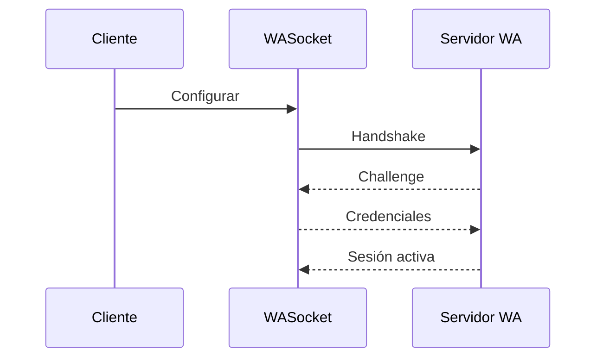
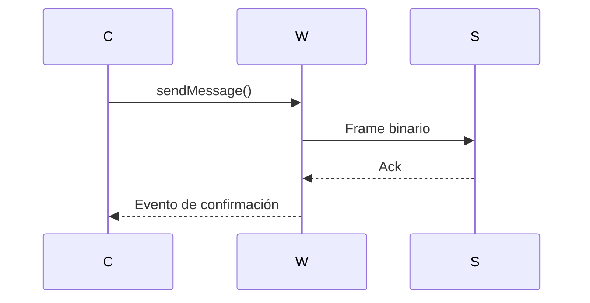

# Flujos unificados

## Tabla de contenidos
- [Conectar y autenticar](#conectar-y-autenticar)
- [Enviar mensaje](#enviar-mensaje)
- [Errores y reintentos](#errores-y-reintentos)
- [Proveniencia](#proveniencia)

## Conectar y autenticar

## Enviar mensaje

## Errores y reintentos
- Reintentar conexión ante códigos de cierre temporales.
- Registrar timeouts superiores a 30s.

## Proveniencia
- [Codex flujos](../DocumentationCodex/04-flujos-tecnicos.md)
- [Jules flujos](../DocumentationJules/04-flujos-tecnicos.md)
